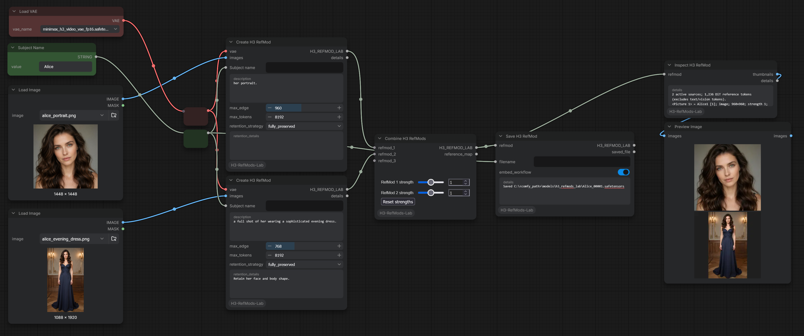
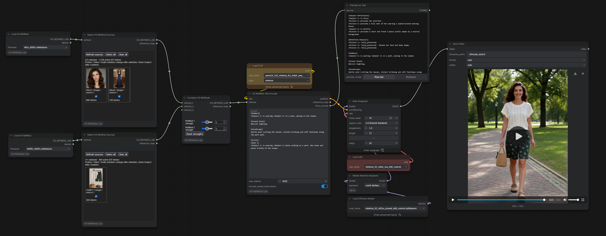

# H3 RefMods Lab

Build reusable MiniMax H3 reference packs from images, video and audio, then mix and select sources for each generation.

Save encoded references, subject descriptions and retention instructions together – spend less time preparing references and more time creating.

**Features**

- Build once, reuse across generations. Save encoded references as compact `.safetensors` RefMods, avoiding repeated VAE encoding.
- Choose your references for each generation. Include or exclude individual sources from a loaded RefMod without rebuilding it.
- Mix images, video and audio. Combine separate reference packs into one reusable RefMod.
- Save subject descriptions and retention instructions. Automatically assemble subject definitions and retention analysis in the H3 prompt, leaving you to describe the target video.
- Control reference influence. Adjust individual source strengths and apply a strength multiplier to each RefMod when combining.
- Combine up to 100 RefMods. Dynamically expanding inputs make it easy to assemble larger reference collections.
- Reopen the creation workflow. Drag a RefMod saved with embedded workflow metadata into ComfyUI to recover its original workflow.

**Version 0.1.2** — an early release of the ComfyUI nodes. Interfaces and compatibility are still evolving.

## Install and start

Use a recent ComfyUI version with native MiniMax H3 and subgraph support. From
your ComfyUI folder, run:

```bash
git clone https://github.com/entert-ai/ComfyUI-H3-RefMods-Lab.git custom_nodes/ComfyUI-H3-RefMods-Lab
```

Restart ComfyUI and refresh its browser page. Find the nodes under
**MiniMax H3 / RefMods Lab**. The dependencies in [requirements.txt](requirements.txt)
are included in a standard ComfyUI installation.

**Creating RefMods needs the appropriate H3 VAE.** Generating video also needs
an H3 Ref2VA model, its Qwen3-VL text encoder, and the visual/audio VAEs. Select
your installed variants in the workflows; weights and source files are not included.

To update, run `git pull` inside the node's repository folder, then restart
ComfyUI and refresh the browser.

## Example workflows

Drag either JSON into ComfyUI. The screenshots open at full resolution when clicked.

### 1. Create Alice and prepare an outfit

[](docs/images/01_create_refmod_Alice.png)

Open [01_create_refmod_Alice.json](workflows/01_create_refmod_Alice.json).

1. Choose a portrait, a full-body image and your H3 visual VAE.
2. Keep the shared **Subject Name** as `Alice`. Give each source a description,
   retention strategy and encoding resolution.
3. Queue to encode, combine, preview and save the two sources as one RefMod.

**Prepare Outfit1 with the same workflow:** change Subject Name to `Outfit1`,
replace the images with outfit references, and replace Alice's descriptions and
retention details with clothing details. For example, describe `its front view`
and the cut, colour and fabric to preserve with `fully_preserved`. Disconnect
the unused Create branch from Combine if using one image, then queue to save.

The first saves are `Alice_00001.safetensors` and `Outfit1_00001.safetensors`.
Use the actual saved filenames if your counters are already higher. If Alice's
source clothing differs from the target outfit, choose `partially_preserved`
for that Alice source and specify that her identity stays while clothing may change.

### 2. Select, combine and generate

[](docs/images/02_generate_with_refmod_Alice.png)

Open [02_generate_with_refmod_Alice.json](workflows/02_generate_with_refmod_Alice.json).

1. Select your Alice and Outfit packs in the Load nodes and your installed models
   in the loaders, including the audio VAE inside the sampling subgraph.
2. Click **Refresh sources** in each selector and choose the references to use.
3. Balance the packs with Combine's strength sliders, edit the video description,
   and queue to generate a video with audio.

**Include saved reference instructions** is enabled. Text Encode adds the saved
subject definitions and retention analysis; Preview Any shows the exact final prompt.
With Alice first and Outfit second, both active, `<Subject 1>` is Alice and
`<Subject 2>` is Outfit1. Check that mapping whenever you change the references.

Resolution, length, seed and steps are exposed on the sampling subgraph. The
example uses Euler/simple at 24 fps and selects Comfy Kitchen attention through
the native Model Attention Backend node. If unavailable, ComfyUI falls back to
PyTorch attention. Model choices remain editable.

## Nodes

| Node | Use |
| --- | --- |
| Create H3 RefMod | Encode images as individual reference sources. |
| Create H3 Video RefMod | Encode a video, optionally with its soundtrack. |
| Create H3 Audio RefMod | Encode an audio reference. |
| Combine H3 RefMods | Merge up to 100 packs with a strength slider per input. |
| Select H3 RefMod Sources | Include or exclude sources without re-encoding. |
| H3 RefMod Text Encode | Build the prompt, present references to Qwen and attach saved latents. |
| Set H3 RefMod Instructions | Edit subject descriptions and retention metadata without re-encoding. |
| Save / Load H3 RefMod | Store and reuse numbered `.safetensors` packs. |
| Inspect H3 RefMod | Preview sources, active reference labels and token usage. |
| Apply H3 RefMod (Latents Only) | Attach latents to existing conditioning without presenting media to Qwen. |

## Prompt and reference controls

- **Subject names group sources.** Use the same name across a subject's image,
  video and audio branches; case and extra spaces are ignored. Different subjects
  need distinct names. Start descriptions with `his`, `her` or `its`, such as
  `her portrait`. Descriptions are used as written.
- **Automatic prompt sections are optional.** Enable `include_saved_instructions`
  in Text Encode and write the target video's action, shots, style and sound.
  Remove manual `[Subject Definitions]` and `[Retention Analysis]` sections
  when enabled. Use `final_prompt` to inspect the result.
- **Labels follow active references.** Subject, Picture, Video and Audio numbers
  can change after selection or reordering. Scene references are not rewritten
  automatically. Check the final prompt and reference map before generating.
- **Strength applies per Combine input.** The range is 0–2, with 1 as the baseline.
  For independent control of a source, select it into a separate Combine input.
  Zero omits the reference from Qwen and diffusion; strengths are experimental,
  not identity-retention percentages.
- **Edit metadata with Set Instructions.** It changes every incoming source;
  select a subset first to edit only those sources. For standalone audio, use
  its audio retention controls. Save the output to persist your edits.

| Reference | Retention strategies |
| --- | --- |
| Image / video | `fully_preserved`, `partially_preserved`, `attribute_transfer`, `weak_reference` |
| Audio | `fully_copy`, `partially_copy`, `reference`, `weak_reference` |

`unspecified` leaves the strategy unset. Retention instructions guide the prompt;
they do not change latent strength or guarantee the outcome. Paired video/audio
has separate visual and soundtrack retention controls.

**Text Encode already attaches the references. Do not also Apply the same pack.**

## Saving and reopening

Packs are saved to `ComfyUI/models/h3_refmods_lab`. Each filename prefix has a
persistent counter; deleting old files does not restart it. Back up the hidden
`.h3-refmods-counter.sqlite3` file with your packs to preserve the counters.

**Embed workflow** is on by default. Drag a saved RefMod into ComfyUI to reopen
its creation graph. Original source files are needed to rerun that graph, but
loading the saved pack for generation does not require them. Embedded workflows
include prompts and filenames; disable embedding before sharing if needed.

## Practical limits and troubleshooting

- **Large references cost more.** Higher resolution and longer clips increase
  token usage and generation memory. Start small; `max_edge` limits visual
  resolution and `max_tokens` checks the reference budget.
- **Video timing is normalized.** Supply the source's actual fps. Video is sampled
  at 24 fps and trimmed to H3's frame alignment. Long input videos may use substantial
  RAM before trimming. A video and its paired soundtrack are selected together.
- **Audio needs explicit instructions.** Qwen receives audio labels, not a
  transcript. Describe whether to follow a voice, rhythm, soundtrack or ambience.
- **Changed sources may pause generation.** If a saved selection becomes stale,
  run once to refresh its cards, then reselect, choose **Select all**, or use
  **Keep available selection** and run again. An empty selection omits the pack;
  empty packs cannot be saved.
- **This is the Lab RefMod format.** Lab v1 image packs and v2 mixed packs are
  supported; other community RefMod formats are not interchangeable.

See [technical notes](docs/technical-notes.md) for encoding details, API inputs,
older-workflow migration and developer verification.
